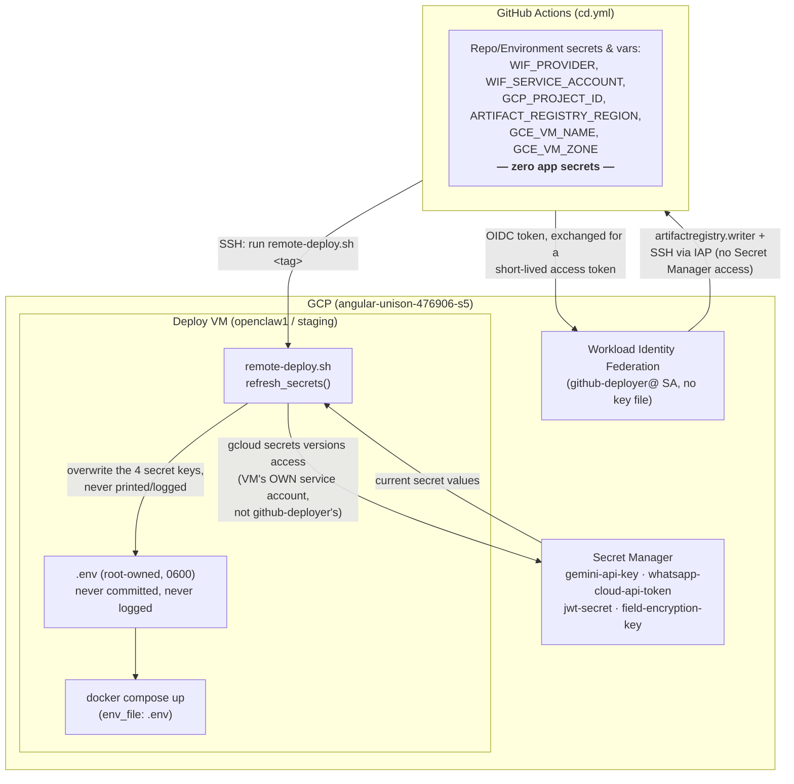

# Deployment (HLD Section 13)

Walks through bringing the stack up on a fresh GCP Compute Engine VM:
Nginx (TLS termination) → OpenClaw Gateway (+ inbound/broadcast workers) →
PostgreSQL + Redis, per the HLD Sec 13 architecture diagram. See
[`docs/security.md`](security.md) for the security posture referenced
throughout (secrets, HTTPS-only, etc.) and
[`docs/runbooks/backup-restore.md`](runbooks/backup-restore.md) for backups.

## What's in `/docker`

| File                  | Role                                                                                                                                                               |
| --------------------- | ------------------------------------------------------------------------------------------------------------------------------------------------------------------ |
| `Dockerfile`          | Multi-stage build (see its own header comment) — one image, used by all three app processes (`gateway`, `worker`, `broadcast-worker`), CMD overridden per service. |
| `docker-compose.yml`  | The full stack: `gateway`, `worker`, `broadcast-worker`, `nginx`, `certbot`, `postgres`, `redis`, optional `chroma`.                                               |
| `nginx.conf.template` | TLS termination + reverse proxy — a template (`${DOMAIN}` substituted at container start, see its own header comment), not a static file.                          |

## 1. Provision the GCP resources

Every GCP resource HLD Sec 14 lists — Compute Engine VM, Static IP,
Firewall, Cloud DNS, Secret Manager, Cloud SQL (optional), Cloud
Storage — is provisioned by one documented script rather than manual
`gcloud` commands here, so there's exactly one place this is defined:

```bash
cp scripts/provision-gcp.env.example scripts/provision-gcp.env
# edit scripts/provision-gcp.env: PROJECT_ID and DOMAIN at minimum
source scripts/provision-gcp.env
./scripts/provision-gcp.sh
```

See `scripts/provision-gcp.sh`'s own header and per-resource comments for:
what each function does, why Cloud SQL/Cloud DNS are opt-in
(`PROVISION_CLOUD_SQL`/`PROVISION_DNS`, both default `false` — this repo's
default path is docker-compose's self-hosted `postgres` service and
DNS managed at your registrar), the Compute Engine sizing rationale
(`VM_MACHINE_TYPE`, default `e2-medium`), and why the firewall rule it
creates opens only 80/443 (HLD Sec 14/15) with SSH access handled
separately via IAP (printed at the end of the script's run) rather than
opening port 22.

The script prompts for secret values (Gemini/WhatsApp/JWT/encryption keys)
with hidden input and creates the matching Secret Manager secrets — it
never writes them to disk or shell history. It also prints the exact
`GCP_SECRET_*`/`DOMAIN`/`GCP_STORAGE_BUCKET`/`BACKUP_GCS_BUCKET` values to
put in `.env` once it finishes.

If you're using Cloud SQL (`PROVISION_CLOUD_SQL=true`) instead of
self-hosted Postgres, see "Cloud SQL: the Auth Proxy" further down this
document before continuing — it needs one more docker-compose service the
default path doesn't.

Point your domain's DNS `A` record at the static IP the script prints
(skip if you set `PROVISION_DNS=true` — it did this for you) before
continuing — Let's Encrypt's HTTP-01 challenge (step 5 below) needs the
domain to actually resolve to this VM.

## 2. Install Docker + Compose

```bash
gcloud compute ssh ai-housing-secretary --zone=asia-south1-a

curl -fsSL https://get.docker.com | sudo sh
sudo usermod -aG docker $USER
newgrp docker
docker compose version   # bundled with the Docker Engine install above
```

(`scripts/provision-gcp.sh`'s VM startup script already installs Docker,
the Compose plugin, and the Cloud Ops Agent on first boot, and
authenticates Docker to this project's Artifact Registry — this step
mostly just confirms they're there and gets `docker` working in your
current shell session without a re-login, via `newgrp docker`. The `gcloud
compute ssh` above works without a manually managed SSH key pair — OS
Login is on by default, see this doc's "CI/CD Auth" section.)

## 3. Clone the repo and configure secrets

```bash
git clone <repo-url> ai-housing-secretary
cd ai-housing-secretary
cp .env.example .env
```

Fill in `.env` — see [`docs/security.md`](security.md)'s "Secrets" section
for the full picture, but in short: **either**

- set the plaintext values directly (`GEMINI_API_KEY`,
  `WHATSAPP_CLOUD_API_TOKEN`, etc.) for a quick/low-stakes deployment, **or**
- set `SECRETS_SOURCE=gcp` and the `GCP_SECRET_*` resource names, and put
  the real values in GCP Secret Manager instead — the recommended
  production path (`config/secrets.ts` resolves them at every process
  boot; see `docs/security.md`).

Also set, specifically for this deployment layer:

- `DOMAIN` — your domain (e.g. `secretary.example-society.in`); substituted
  into `nginx.conf.template`.
- `FIELD_ENCRYPTION_KEY` — `openssl rand -base64 32` (HLD Sec 15's
  field-level encryption — see `docs/security.md`). **Generate this once
  and keep it** — losing it makes every resident's `phone_e164`/
  `emergency_contact` permanently unreadable.
- `JWT_SECRET` — only if you want `/admin/*` mounted (see
  `docs/security.md`'s JWT/RBAC section); leave unset to skip it entirely.

`.env` is `.gitignore`d and is read by every service via
`docker-compose.yml`'s `env_file: ../.env` — never commit it.

## 4. Bootstrap TLS: start Nginx with a temporary self-signed cert

This is the standard certbot+nginx chicken-and-egg fix: `nginx.conf.template`'s
`ssl_certificate` directive points at
`/etc/letsencrypt/live/${DOMAIN}/{fullchain,privkey}.pem`, but nginx
refuses to start at all if that file is missing — and certbot's own
`--webroot` issuance needs nginx already running to serve the ACME
challenge. Break the cycle with a throwaway self-signed cert first:

```bash
cd docker
docker compose up -d postgres redis   # bring dependencies up first

DOMAIN=secretary.example-society.in   # match your .env

docker run --rm -v docker_certbot_certs:/etc/letsencrypt alpine:3.20 sh -c "
  apk add --no-cache openssl
  mkdir -p /etc/letsencrypt/live/${DOMAIN}
  openssl req -x509 -nodes -newkey rsa:2048 -days 1 \
    -keyout /etc/letsencrypt/live/${DOMAIN}/privkey.pem \
    -out /etc/letsencrypt/live/${DOMAIN}/fullchain.pem \
    -subj '/CN=${DOMAIN}'
"

DOMAIN=${DOMAIN} docker compose up -d
```

At this point the stack is fully up, but browsers will show a certificate
warning on HTTPS — expected, this cert is a throwaway. `curl -k` (or your
browser's "proceed anyway") works for smoke-testing in the meantime.

**Verified live** (this session): this exact bootstrap sequence was run
end-to-end (scratch Postgres/Redis, a real self-signed cert generated
into the `certbot_certs` volume, nginx restarted) — every container came
up `healthy` and `GET /health`, `GET /health/ready`, `POST/GET /webhook`
(proxied through to the gateway, not 404ing), `GET /admin/escalations`
(401 with no token, proxied through — not swallowed by nginx), an
unlisted path (`GET /nonexistent` → nginx's own 404, never reaching the
gateway), and the `Strict-Transport-Security` header all behaved exactly
as designed. The one thing _not_ exercised — obtaining a real cert from
Let's Encrypt's actual servers — needs a real public domain pointing at a
real VM, which this sandbox doesn't have; that mechanical piece (steps 5
below) is the standard, widely-used `certbot --webroot` flow and is not
this repo's own code to verify.

## 5. Get a real certificate

```bash
DOMAIN=secretary.example-society.in
EMAIL=secretary@example-society.in

docker compose run --rm certbot certonly \
  --webroot -w /var/www/certbot \
  -d "${DOMAIN}" \
  --email "${EMAIL}" --agree-tos --no-eff-email
```

If this succeeds, the real cert has replaced the self-signed one in the
same `certbot_certs` volume path nginx already reads from — reload nginx
to pick it up (no restart/downtime needed):

```bash
docker compose exec nginx nginx -s reload
```

The long-running `certbot` service (already part of `docker compose up -d`
above) handles renewal automatically from here — it loops `certbot renew`
every 12 hours, a no-op until the cert is within its renewal window.

## 6. First migration and seed

```bash
docker compose exec gateway node dist/db/migrate.js
```

Seeding (`pnpm db:seed`, `scripts/seed.ts`) is **not** available inside the
deployed container — `scripts/` and `tsx` are dev-only and deliberately
excluded from the production image (`docker/Dockerfile`'s multi-stage
build; see `tsconfig.build.json`), keeping the runtime image lean. It's
also sample/demo data, not something a real deployment normally wants
anyway — a real society's resident list should be loaded from its actual
records, not this repo's 5 fictional residents. To seed a **staging/demo**
environment, run it from a machine with `pnpm`/`tsx` installed and
`DATABASE_URL` pointed at the deployed Postgres (e.g. over an SSH tunnel
to the VM, or directly if `postgres`'s `5432:5432` port mapping is
reachable):

```bash
DATABASE_URL=postgresql://postgres:postgres@<VM_IP>:5432/ai_housing_secretary pnpm db:seed
```

**Verified live** (this session): `node dist/db/migrate.js` was run inside
the running `gateway` container against the compose-managed Postgres and
applied all 5 migrations cleanly (`Migrations applied successfully.`).

## 7. Configure the WhatsApp webhook

In Meta's App Dashboard (WhatsApp > Configuration): set the webhook URL to
`https://<DOMAIN>/webhook` and the verify token to `WHATSAPP_VERIFY_TOKEN`
(`.env`). Meta's verification GET request is handled by
`gateway/webhook.ts`'s `verifyChallenge` — a successful setup shows
"Verified" in the dashboard immediately.

## Cloud SQL: the Auth Proxy (only if `PROVISION_CLOUD_SQL=true`)

`scripts/provision-gcp.sh`'s Cloud SQL instance doesn't get a public IP —
the recommended, private connection path is the Cloud SQL Auth Proxy,
running as one more container alongside the app, not a change to
`DATABASE_URL`'s host/port (it already points at `127.0.0.1:5433`, which
is the proxy, not Cloud SQL directly — see the script's `create_cloud_sql`
output). Add this service to `docker/docker-compose.yml` (or a
`docker-compose.override.yml` layered on top, so the base file stays
correct for the default self-hosted-Postgres path):

```yaml
cloud-sql-proxy:
  image: gcr.io/cloud-sql-connection-name/cloud-sql-proxy:latest
  command:
    - '--address=0.0.0.0'
    - '--port=5433'
    - '${GCP_CLOUD_SQL_INSTANCE_CONNECTION_NAME}'
  network_mode: 'service:gateway' # shares gateway's network namespace so 127.0.0.1:5433 in DATABASE_URL resolves
  restart: unless-stopped
```

The VM's service account (created by `scripts/provision-gcp.sh`, granted
`roles/cloudsql.client`) authenticates the proxy automatically via the
instance's metadata server — no separate key file to manage. With this
service running, skip `docker-compose.yml`'s `postgres` service entirely
(`docker compose up -d --scale postgres=0`, or remove it from the file
you deploy with) — it would otherwise be an unused second Postgres.

## Cloud Monitoring & Logging (HLD Sec 14)

Two separate mechanisms, because "VM-level system observability" and
"this app's own container logs" are different problems:

- **Cloud Monitoring + Cloud Logging for the VM itself** (CPU/memory/disk
  metrics, system logs) — the **Ops Agent**, installed automatically by
  `scripts/provision-gcp.sh`'s VM startup script (see that script's
  `create_vm` function). Nothing further to configure; metrics appear
  under the VM's resource in Cloud Monitoring, system logs under
  `resource.type="gce_instance"` in Cloud Logging's Logs Explorer.
- **Cloud Logging for the gateway/worker container logs specifically**
  (HLD Sec 14's actual ask) — Docker's built-in `gcplogs` logging driver,
  which ships each container's stdout/stderr straight to Cloud Logging
  with the container name as a label, no extra agent needed. Add to each
  app service in `docker/docker-compose.yml`:

  ```yaml
  logging:
    driver: gcplogs
    options:
      gcp-project: '${GCP_PROJECT_ID}'
      labels: 'com.docker.compose.service'
  ```

  Requires the Docker daemon on the VM to have the `gcplogs` driver
  available (bundled with Docker Engine — no separate install) and the
  VM's service account to have `roles/logging.logWriter`
  (`scripts/provision-gcp.sh`'s `create_service_account` already grants
  this). Query these logs in Logs Explorer with
  `resource.type="global" AND logName:"gcplogs-docker-driver"`, or filter
  by `labels."com.docker.compose.service"="gateway"` for just one
  service's logs.

  Not the default in `docker-compose.yml` as written (that file targets
  the plain local-dev/single-VM path first) — add the `logging:` block
  above to each service once you're running on the VM, or layer it via a
  `docker-compose.override.yml` kept separate from the base file, same
  pattern as the Cloud SQL Auth Proxy service above.

## Healthchecks (HLD Sec 13)

| Service                       | Mechanism                                                                                                                                                                                                                                                                                                                                                              |
| ----------------------------- | ---------------------------------------------------------------------------------------------------------------------------------------------------------------------------------------------------------------------------------------------------------------------------------------------------------------------------------------------------------------------- |
| `gateway`                     | Inherited from the image (`docker/Dockerfile`'s `HEALTHCHECK`) — `GET /health`, liveness only, no dependency I/O. `docker compose ps` shows `(healthy)`.                                                                                                                                                                                                               |
| `gateway` readiness           | `GET /health/ready` (`gateway/health.ts`) — actually pings Redis (always) and Postgres (only when `JWT_SECRET`/admin routes are mounted). 503 if either is down. Not wired into Docker's own `HEALTHCHECK` (that stays a pure liveness probe, HLD Sec 13's intent) — check this manually or from an external monitor when you need to know _why_ something's degraded. |
| `worker` / `broadcast-worker` | `healthcheck: disable: true` — BullMQ consumers, no HTTP server to probe; `restart: unless-stopped` is the safety net for a crashed process instead.                                                                                                                                                                                                                   |
| `postgres`                    | `pg_isready` (Compose healthcheck).                                                                                                                                                                                                                                                                                                                                    |
| `redis`                       | `redis-cli ping` (Compose healthcheck).                                                                                                                                                                                                                                                                                                                                |
| `nginx`                       | `curl -f http://localhost/health` on port 80 (Compose healthcheck) — deliberately port 80, not 443, so it works even before step 5's real cert exists (see that healthcheck's own comment in `docker-compose.yml`).                                                                                                                                                    |
| `chroma` (optional)           | `wget` against its `/api/v1/heartbeat` endpoint (Compose healthcheck), only relevant if `VECTOR_DB_PROVIDER=chroma`.                                                                                                                                                                                                                                                   |

`gateway`/`nginx`'s `depends_on: condition: service_healthy` means Compose
won't even start them until Postgres/Redis (and, for nginx, the gateway)
report healthy — a fresh `docker compose up -d` on this stack comes up in
dependency order automatically, not just container-start order.

## Updating the deployment

```bash
git pull
DOMAIN=secretary.example-society.in docker compose up -d --build
docker compose exec gateway node dist/db/migrate.js   # if the update includes a new migration
```

`--build` rebuilds the `gateway`/`worker`/`broadcast-worker` images from
the updated source; `postgres`/`redis`/`nginx` are unaffected (pulled
images, not built) unless their own version pin in `docker-compose.yml`
changed.

## CI/CD Auth: how GitHub Actions deploys without a service account key

> **Update, live-verified**: `.github/workflows/cd.yml` no longer
> impersonates `github-deployer@` — the `roles/iam.workloadIdentityUser` +
> `service_account:` impersonation path described in this section was
> abandoned after the impersonation call
> (`iam.serviceAccounts.getAccessToken`) was denied on every attempt, for
> every subject tried, with no explanation available from GCP's IAM
> Policy Troubleshooter or Cloud Logging. `cd.yml` now uses **Direct**
> Workload Identity Federation instead: IAM roles granted straight to a
> `principalSet` (`attribute.repository`, scoped to this one repo) rather
> than to a service account a workflow impersonates — no
> `WIF_SERVICE_ACCOUNT` secret, no `service_account:` input. See
> `cd.yml`'s own header comment for the full story. The rest of this
> section (and `scripts/gcp/setup-cicd.sh`, which still provisions the
> old impersonation-based setup) has not been rewritten for the new model
> yet — treat the specific `github-deployer@`/`WIF_SERVICE_ACCOUNT`
> details below as historical, the general WIF concepts (no key file,
> short-lived exchanged credentials, resource-scoped roles) as still
> accurate.

`scripts/gcp/setup-cicd.sh` provisions everything GitHub Actions needs to
build/push images and deploy to this VM — an Artifact Registry repo, a
dedicated `github-deployer@<project>.iam` service account, and a Workload
Identity Federation (WIF) pool/provider — **without ever creating or
downloading a GCP service account JSON key**. `.github/workflows/cd.yml`
is what actually consumes this (build + push, gated behind human
approval — see its own subsection below); rolling the pushed image out to
the VM itself is still a later phase.

### Why no key file

A downloaded SA key is a long-lived credential: if a GitHub secret ever
leaks (a misconfigured workflow, a compromised Action, a fork's PR log),
whoever has it can use it from anywhere, indefinitely, until someone
notices and manually revokes it. Workload Identity Federation removes that
risk structurally rather than relying on rotation discipline:

- GitHub's OIDC token issuer (`token.actions.githubusercontent.com`)
  signs a short-lived token identifying the exact repo, branch, and run.
- GCP's WIF provider trusts that issuer and, per the token's claims,
  lets the calling workflow **exchange** it for short-lived GCP
  credentials — no persistent secret changes hands.
- The exchange is restricted twice over: the provider's
  `--attribute-condition` only accepts tokens from this repo at all, and
  the deploy service account's `roles/iam.workloadIdentityUser` binding
  only accepts tokens whose `sub` claim is exactly
  `repo:<org>/ai-housing-secretary:ref:refs/heads/main` (or
  `STAGING_BRANCH`, if configured) — so a workflow run on any other
  branch, or from a fork's pull request, cannot impersonate the deploy
  identity at all, not even with a leaked repo secret.
- Credentials obtained this way expire in about an hour and are scoped to
  exactly the roles below — nothing to revoke after the fact because
  there's nothing long-lived to revoke.

### What the deploy service account can do (and can't)

`github-deployer@<project>.iam.gserviceaccount.com` holds exactly two
grants, both resource-scoped rather than project-wide:

| Role                                                              | Scope                                                 | Purpose                                                                                                                                                                               |
| ----------------------------------------------------------------- | ----------------------------------------------------- | ------------------------------------------------------------------------------------------------------------------------------------------------------------------------------------- |
| `roles/artifactregistry.writer`                                   | The one `ai-housing-secretary` Artifact Registry repo | Push built `gateway`/`worker`/`broadcast-worker` images                                                                                                                               |
| `roles/compute.osAdminLogin` + `roles/iap.tunnelResourceAccessor` | The one deploy VM instance                            | SSH in via an IAP tunnel (no open port 22 — see `scripts/provision-gcp.sh`'s firewall note), as a passwordless-`sudo` OS Login user, to run `scripts/gcp/remote-deploy.sh` unattended |

`osAdminLogin` (not the plain `osLogin`) specifically because CI has no
TTY to answer a `sudo` password prompt — see `scripts/gcp/setup-cicd.sh`'s
`OS_LOGIN_ROLE` comment for the alternative if you'd rather manage local
`docker`-group membership yourself. Either way, the deploy SA cannot read
Secret Manager, touch other Compute instances, modify IAM, or do anything
outside those two resources. `scripts/gcp/setup-cicd.sh` has a
`DEPLOY_VM_ACCESS_MODE=instance-admin` escape hatch (broader:
`roles/compute.instanceAdmin.v1`, still instance-scoped) for workflows
that need to stop/reset the VM as part of a deploy — off by default.

### What the VM has ready before CI ever connects

`scripts/provision-gcp.sh`'s startup script (Step 8 in this doc) leaves
the VM ready for exactly this kind of unattended, keyless deploy:

- **OS Login enabled** (`ENABLE_OS_LOGIN=true`, the default) — SSH access
  is governed by IAM (the roles above), not a manually distributed key
  pair. This is what lets `github-deployer` SSH in at all.
- **Docker + the Compose plugin** installed, and **`gcloud auth
configure-docker`** already run for this project's Artifact Registry
  region — `docker compose pull` on the VM authenticates via the VM's own
  attached service account (metadata server), no credential file.
- **`DEPLOY_BASE_DIR`** (`/opt/ai-housing-secretary` by default) created
  and ready for `docker-compose.yml`/`.env`/`scripts/gcp/remote-deploy.sh`
  — see that script's own header for exactly what lands here and when.

### `scripts/gcp/remote-deploy.sh` — what CI actually invokes over SSH

Once connected, CI runs this script (scp'd alongside `docker-compose.yml`
into `DEPLOY_BASE_DIR`) with `IMAGE_TAG` set to the image it just built
and pushed:

```bash
IMAGE_TAG=<git-sha> /opt/ai-housing-secretary/remote-deploy.sh
```

It: `docker compose pull` (fetches that tag), runs DB migrations
(`docker compose run --rm gateway node dist/db/migrate.js`),
`docker compose up -d` (rolls out every service), then polls
`http://localhost:8080/health` (the gateway directly, bypassing nginx —
see the script's own comment on why) until it returns `200` or
`HEALTH_TIMEOUT_SECONDS` (default 60s) elapses, **exiting non-zero on
timeout** so the CI step goes red on a bad rollout rather than reporting
success just because containers started. It does not attempt an automatic
rollback (left to the operator / a future phase — see its header comment).

### Running `setup-cicd.sh`

```bash
export PROJECT_ID=your-gcp-project
export GITHUB_REPO=your-org/ai-housing-secretary   # defaults to draj1979/ai-housing-secretary
./scripts/gcp/setup-cicd.sh
```

Requires the deploy VM to already exist (`scripts/provision-gcp.sh` run
first) — IAM bindings above are scoped to that specific instance. Safe to
re-run: every resource is describe-before-create and every IAM binding is
additive, so re-running after setting `STAGING_BRANCH` (to allow deploys
from `develop`, say) only adds the new binding.

It prints, at the end, six values. `.github/workflows/cd.yml` consumes
them as **repo secrets** (`WIF_PROVIDER`, `WIF_SERVICE_ACCOUNT` — the pair
that together identify exactly what a workflow can impersonate) and
**repo variables** (`GCP_PROJECT_ID`, `ARTIFACT_REGISTRY_REGION` — plain,
non-sensitive identifiers; `GCE_VM_NAME`/`GCE_VM_ZONE` aren't used by
`cd.yml` yet, only by a later VM-rollout phase). Add them at Settings ->
Secrets and variables -> Actions, matching that split:

```yaml
- uses: google-github-actions/auth@v2
  with:
    workload_identity_provider: ${{ secrets.WIF_PROVIDER }}
    service_account: ${{ secrets.WIF_SERVICE_ACCOUNT }}
```

### `.github/workflows/cd.yml` — build & push after CI passes

Triggered by `workflow_run` watching `.github/workflows/ci.yml`'s "CI"
workflow (not its own `push:` trigger) so it reuses CI's already-completed
lint/typecheck/test/guardrails/docker-build result instead of re-running
those checks a second time — `ci.yml` alone still defines what "passing"
means. Two independent tracks in the same file, picked by
`github.event.workflow_run.head_branch`:

|                | Trigger branch | Jobs                                             | Environment                      | Target VM                      |
| -------------- | -------------- | ------------------------------------------------ | -------------------------------- | ------------------------------ |
| **Production** | `main`         | `build-and-push-production`, `deploy-production` | `production` — required reviewer | `openclaw1`                    |
| **Staging**    | `develop`      | `build-and-push-staging`, `deploy-staging`       | `staging` — no required reviewer | `ai-housing-secretary-staging` |

Each `build-and-push-*` job authenticates via WIF (`token_format:
access_token`, fed straight into `docker/login-action` — no `gcloud` CLI
needed on that job), then builds and pushes `docker/Dockerfile` to
Artifact Registry — production tags both `latest` and the short git SHA;
staging tags only `staging-<short-sha>` (no `latest`, so the two tracks
can never be confused in the shared Artifact Registry repo) — of the
exact commit CI tested (`github.event.workflow_run.head_sha`, not
whatever the branch happens to point at when the job actually starts —
see the workflow's own "Checkout" step comment for why that distinction
matters). Reuses `ci.yml`'s Docker Build job's `type=gha` cache layer, so
this is usually a fast, mostly-cached push rather than a cold rebuild.

Each `deploy-*` job `needs:` its track's build job and rolls the
just-pushed tag out to that track's VM.

#### `deploy-production` / `deploy-staging` — SSH out, run `remote-deploy.sh`, roll back automatically on failure

Authenticates the same WIF way, then `gcloud compute ssh`/`scp
--tunnel-through-iap` — the same OS Login + IAP mechanism
`scripts/provision-gcp.sh` (enables OS Login) and `scripts/gcp/setup-cicd.sh`
(grants `github-deployer` `roles/compute.osAdminLogin` +
`roles/iap.tunnelResourceAccessor`, scoped to each VM instance in turn —
see "Two VMs, one deploy identity" below) already set up — no SSH key
pair anywhere, `gcloud` generates and registers an ephemeral one per run
via the OS Login API.

1. **Sync**: `docker/docker-compose.yml`, `docker/nginx.conf.template`,
   and `scripts/gcp/remote-deploy.sh` are scp'd to the VM (to the login
   user's home, then moved into the root-owned `DEPLOY_BASE_DIR` with
   `sudo install`) — so a change to any of the three in this repo takes
   effect on the very next deploy, not just at VM provisioning time.
2. **Deploy**: `remote-deploy.sh <tag>` runs over SSH — its own
   stdout/stderr stream straight into the workflow log (nothing
   redirected), so the secret refresh (see "Secret flow" below),
   `docker compose pull`/migration output/healthcheck polling are all
   visible in the Actions UI as they happen — secret _values_ excepted,
   which that step never prints.
3. **Automatic rollback on failure**: if `remote-deploy.sh` exits
   non-zero (its own healthcheck timeout, per its header comment), the
   job reads `DEPLOY_BASE_DIR/.last-good-tag` off the VM (a plain SSH
   `cat` — that file is written by `remote-deploy.sh` itself, right after
   _its own_ successful healthcheck, on every deploy) and re-invokes
   `remote-deploy.sh` with that previous tag. **Either way, the job still
   exits non-zero** — a successful automatic rollback still fails the
   workflow, on purpose, so a bad deploy is always visible in PR/commit
   checks rather than silently self-healed into looking like nothing
   happened. If there's no `.last-good-tag` yet (the very first deploy
   ever), there's nothing to roll back to — that's called out explicitly
   in the log rather than attempted anyway. Production and staging each
   have their own `.last-good-tag` file on their own VM — a bad staging
   deploy can never roll back production or vice versa.
4. **On success**: a deploy summary (commit, tag, time, and — production
   only — who approved, fetched from this run's own deployment-approval
   record via `gh api`, falling back to whoever triggered the underlying
   CI run) is written to the workflow's Job Summary.

#### The "production" / "staging" Environments — the human-in-the-loop gate, and where it's deliberately absent

`deploy-production`'s (and `build-and-push-production`'s)
`environment: { name: production }` means neither starts until a
required reviewer approves. GitHub shares one approval across every job
in a run that targets the same environment, so this is a single click,
not two. Same "nothing ships without a human" rule CLAUDE.md Sec 2
requires of the app itself (broadcasts: draft -> AI improves ->
**secretary approves** -> send), applied to the deploy pipeline.

`staging` has **no required reviewer** — on purpose, not an oversight.
Requiring approval to deploy to the environment whose entire job is
letting someone look at a change _before_ deciding whether to approve it
for production would be circular. `develop` -> staging is meant to be as
fast and unattended as CI itself; the human gate is production's alone.

Creating either Environment is a repo-settings action, not something
this YAML file can declare on its own — either through Settings ->
Environments -> New environment, or via `gh api` (what was actually run
for this repo):

```bash
# production — required reviewer, restricted to main
gh api -X PUT repos/<owner>/<repo>/environments/production \
  -H "Accept: application/vnd.github+json" \
  -f 'reviewers[][type]=User' -F 'reviewers[][id]=<reviewer-user-id>' \
  -F 'deployment_branch_policy[protected_branches]=false' \
  -F 'deployment_branch_policy[custom_branch_policies]=true'
gh api -X POST repos/<owner>/<repo>/environments/production/deployment-branch-policies \
  -f 'name=main'

# staging — no reviewers, restricted to develop
gh api -X PUT repos/<owner>/<repo>/environments/staging \
  -H "Accept: application/vnd.github+json" \
  -F 'deployment_branch_policy[protected_branches]=false' \
  -F 'deployment_branch_policy[custom_branch_policies]=true'
gh api -X POST repos/<owner>/<repo>/environments/staging/deployment-branch-policies \
  -f 'name=develop'

# Per-Environment variables — GCE_VM_NAME/GCE_VM_ZONE differ by
# Environment (see "Two VMs, one deploy identity" below); the exact same
# `${{ vars.GCE_VM_NAME }}` expression in cd.yml resolves differently
# depending on which Environment the job references.
gh api -X POST repos/<owner>/<repo>/environments/production/variables \
  -f name=GCE_VM_NAME -f value=openclaw1
gh api -X POST repos/<owner>/<repo>/environments/production/variables \
  -f name=GCE_VM_ZONE -f value=asia-south1-c
gh api -X POST repos/<owner>/<repo>/environments/staging/variables \
  -f name=GCE_VM_NAME -f value=ai-housing-secretary-staging
gh api -X POST repos/<owner>/<repo>/environments/staging/variables \
  -f name=GCE_VM_ZONE -f value=asia-south1-a
```

Environment protection rules (required reviewers) need the repo to be
public, or private on a paid GitHub plan — same constraint this repo hit
setting up branch protection (see that section's own history) — this
repo is public, so it worked directly.

#### Two VMs, one deploy identity

`ai-housing-secretary-staging` (`e2-small`, `asia-south1-a`) is a second,
smaller, fully separate VM from `openclaw1` — same provisioning script
(`scripts/provision-gcp.sh`, just a different `VM_NAME`/`ZONE`/
`VM_MACHINE_TYPE`/`VM_SERVICE_ACCOUNT_NAME`), same Docker/OS Login/
Artifact-Registry-auth setup, its own dedicated service account
(`ai-housing-staging-vm@`, distinct from production's
`ai-housing-secretary-vm@`), its own static IP, its own `.env` and
`.last-good-tag`. The one thing intentionally **not** duplicated is the
deploy identity: `github-deployer@` is the same service account for both
tracks, bound to two separate branch subjects
(`scripts/gcp/setup-cicd.sh`'s `STAGING_BRANCH=develop`, re-run once
against each VM to grant it instance-scoped `iap.tunnelResourceAccessor`/
`osAdminLogin` on that VM specifically) — GitHub's branch/Environment
gating is what actually separates the two tracks, not two unrelated GCP
identities.

**Known simplification, flagged rather than silently left implicit**:
staging currently reads the _same_ Secret Manager secrets as production
(`gemini-api-key`, `whatsapp-cloud-api-token`, `jwt-secret`,
`field-encryption-key` — see "Secret flow" below), since
`remote-deploy.sh`'s `SECRET_MAP` names are fixed, not per-environment.
Split these into dedicated `staging-*` secret resources first if staging
should exercise different WhatsApp Business/Gemini credentials, or if a
`JWT_SECRET`/`FIELD_ENCRYPTION_KEY` rotation on production shouldn't also
affect staging sessions. Also worth knowing: WhatsApp's own webhook
verify token/app secret (`WHATSAPP_VERIFY_TOKEN`/`WHATSAPP_APP_SECRET`)
aren't in `SECRET_MAP` at all (they're operator-chosen values, not
Meta-issued credentials in the strict sense) — staging's `.env` uses
placeholder values for both, since no real Meta webhook is registered
against the staging VM.

## Secret flow: what never touches GitHub, and what does

The rule this whole pipeline is built around: **GitHub Actions never
holds an app secret — only identity plumbing.**



The two identities never overlap on purpose:

- **`github-deployer@`** (what CI is) can push images and SSH into the
  deploy VM. It has **no Secret Manager role at all** — even a fully
  compromised WIF credential for this identity can't read a single app
  secret.
- **`ai-housing-secretary-vm@`** / **`ai-housing-staging-vm@`** (what
  each VM's own attached identity is) has `roles/secretmanager.secretAccessor`
  and nothing resembling deploy/push permissions. It's `remote-deploy.sh`
  running _as this identity, on the VM itself_ — never CI — that ever
  calls `gcloud secrets versions access`.

So the actual value never leaves GCP's own boundary: Secret Manager ->
(VM's own service account) -> `.env` on that one VM's disk, root-owned
`0600`. GitHub only ever sees enough to say "push this image" and "run
this script on that VM" — never the payload the script fetches once
it's already there. See `scripts/gcp/remote-deploy.sh`'s `refresh_secrets()`
for the implementation (temp file + atomic `install`, so a failed fetch
partway through never leaves `.env` half-written, and nothing is ever
piped through `echo`/logged).

## Vector store: PGVector (default) vs ChromaDB

Default (`VECTOR_DB_PROVIDER=pgvector` in `.env`) needs nothing extra — the
`postgres` service's image is already `pgvector/pgvector:pg16`. To use
standalone ChromaDB instead: set `VECTOR_DB_PROVIDER=chroma` and
`CHROMA_URL=http://chroma:8000` in `.env`, and start the stack with the
`chroma` profile:

```bash
docker compose --profile chroma up -d
```

## The CI/CD/deploy pipeline — how it was actually verified

Everything above stopped being "checked via `--help` output and hoped"
partway through this project and became "run against a real GCP project
and a real VM" — worth recording plainly, including the real bugs that
only a live run surfaced (static analysis and `--help` reading missed
every one of them):

- **Real project, real VMs**: `openclaw1` (production) and
  `ai-housing-secretary-staging` (staging) both actually provisioned
  in `angular-unison-476906-s5` — service accounts, WIF pool/provider,
  IAM bindings, Artifact Registry repo, Secret Manager secrets, Docker +
  OS Login setup, all via the real scripts, not simulated.
- **Real end-to-end deploys, both tracks**: `remote-deploy.sh` run
  directly against both VMs — `docker compose pull`, migrations,
  `up -d`, healthcheck polling — with every service (gateway, worker,
  broadcast-worker, postgres, redis) coming up healthy and
  `GET /health` returning `200` on each.
- **Real bugs found and fixed this way, not any other**:
  `iap.tunnelResourceAccessor`/`osAdminLogin` aren't grantable at the
  Compute instance-IAM level at all (only project-level with an IAM
  Condition); `--condition=None` is required on every _unconditioned_
  `add-iam-policy-binding` call once a project's policy contains _any_
  conditioned binding; `docker-compose.yml`'s `env_file: ../.env` needs
  a `docker/` subdirectory nesting `remote-deploy.sh` wasn't originally
  creating; Compose's project-name default changed the moment that
  nesting was fixed, orphaning containers on the ports the next deploy
  needed; `sudo` drops custom env vars by default, silently breaking
  `COMPOSE_PROJECT_NAME` pinning across that boundary; `db/migrate.ts`
  (and `seed.ts`/`ingest-knowledge.ts`) never resolved
  `SECRETS_SOURCE=gcp` secrets at all; and, the systemic form of that
  last one, `gateway/index.ts`'s default-parameter tool constructors
  read raw `process.env` instead of the already-resolved config one
  call up — fixed by having `loadEnvAsync` patch `process.env` itself.
  None of these were hypothetical — each one blocked an actual deploy
  until fixed.
- **Idempotency actually re-run, not assumed**: `setup-cicd.sh` run
  twice back-to-back against the same project confirmed via
  `gcloud projects get-iam-policy --flatten` that no duplicate bindings
  were created.

What's still _not_ been exercised live: Cloud SQL/DNS provisioning
(`PROVISION_CLOUD_SQL`/`PROVISION_DNS`, both off by default — the
self-hosted-Postgres/manually-managed-DNS path is what was actually
run), and a real Let's Encrypt certificate issuance (needs DNS actually
pointing at a VM's static IP, which neither `openclaw1` nor the staging
VM has had done yet — nginx crash-loops on both for exactly this reason,
expected per this doc's own TLS bootstrap section).
